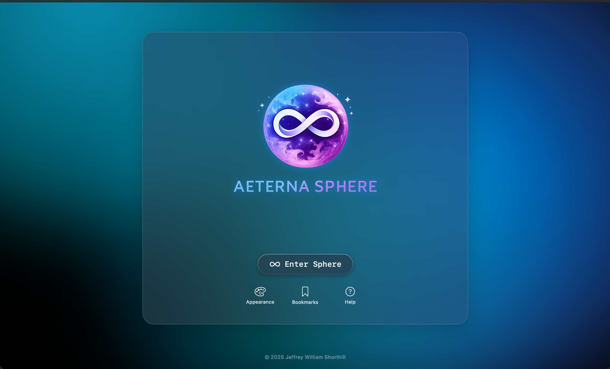
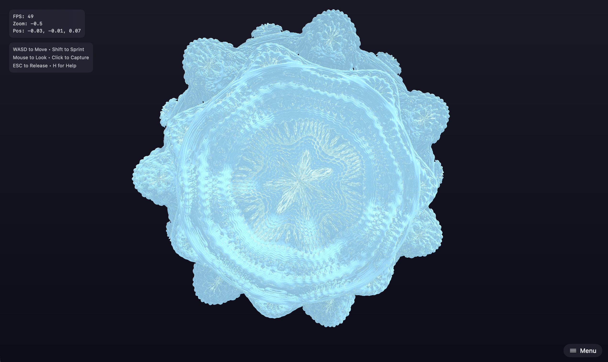
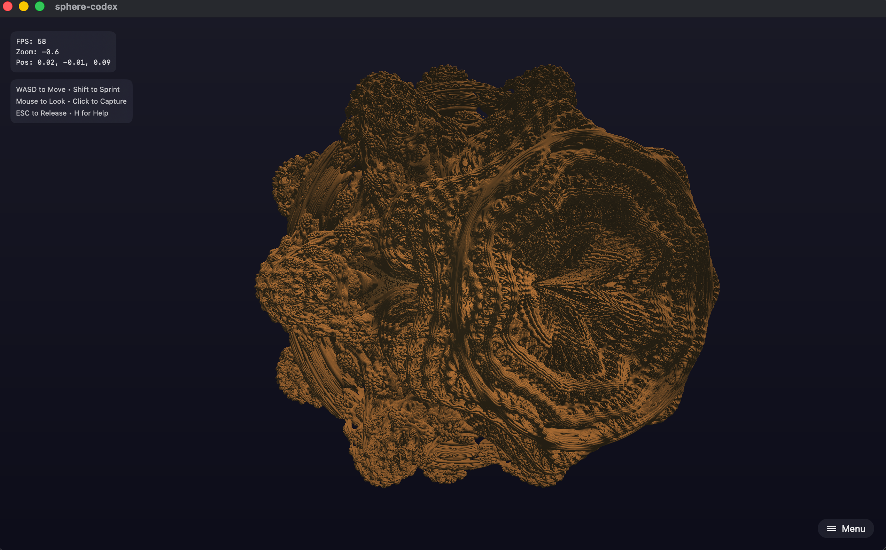

# 🔮 Aeterna Sphere
## Powered by  Metal


> **Explore the infinite complexity of the Mandelbulb fractal in real-time.** 
> Use a gamepad or keyboard to dive deep into a recursively generated alien world, rendered entirely on the GPU with Apple Metal.



## ✨ Features

- **🚀 Infinite Navigation**: Seamless floating-origin navigation system with logarithmic depth scaling allows you to zoom in indefinitely without precision loss.
- **⚡️ Native Metal Rendering**: High-performance raymarching shader running at 60 FPS on Apple Silicon.
- **🎮 Full Gamepad Support**: Plug-and-play support for Xbox and PlayStation controllers with analog movement and trigger-based speed control.
- **📍 Bookmarks**: Save interesting locations and teleport back to them instantly.
- **🖥️ HUD Overlay**: Real-time stats including FPS, depth scale, and precise coordinate tracking.

## 🎮 Controls

### Keyboard & Mouse
| Action | Input |
| :--- | :--- |
| **Move** | `W` `A` `S` `D` |
| **Vertical** | `E` (Up) / `Q` (Down) |
| **Look** | Mouse (Click to Capture) |
| **Speed** | `Shift` to Sprint |
| **UI** | `H` (Help) / `I` (Stats) |
| **Release Mouse** | `ESC` |

### Gamepad
| Action | Input |
| :--- | :--- |
| **Move** | Left Stick |
| **Look** | Right Stick |
| **Throttle** | `RT` (Accel) / `LT` (Brake) |
| **Precision** | `B` (Toggle Slow Mode) |
| **Reset** | `A` (Return to Origin) |

## 🛠 Installation & Build

1. **Clone the repository**
   ```bash
   git clone https://github.com/jeffreywilliamportfolio/sphere-fractal-swift.git
   cd sphere-fractal-swift
   ```

2. **Open in Xcode**
   Open the folder or `.xcodeproj` in Xcode 15+.

3. **Run**
   Select the target `Generic macOS Device` or your Mac and press `Cmd + R`.

## 🧠 How It Works

This project demonstrates several advanced graphics techniques:

*   **Raymarching**: Instead of rasterizing triangles, the scene is drawn by marching rays from the camera into a mathematical distance field (SDF).
*   **The Mandelbulb**: The fractal is generated using an iterative power-8 formula ($z_{n+1} = z_n^8 + c$) defined purely in math.
*   **Floating Origin**: To support infinite zooming, the camera never actually moves far from the origin $(0,0,0)$. Instead, the world scales around the camera, and "movement" is simulated by updating a coordinate offset `uOffset`.
*   **Logarithmic Depth**: Zoom level is tracked via `logScale`, allowing us to render depths like $10^{-60}$ without hitting floating-point precision limits.

## 📸 Gallery

| Deep Zoom | Surface Detail | Lighting |
| :---: | :---: | :---: |
|  |  |  |

## 📄 License

This project is licensed under the MIT License - see the [LICENSE](LICENSE) file for details.

---

<p align="center">
  Built with ❤️ by Jeffrey | Powered by  Metal
</p>
